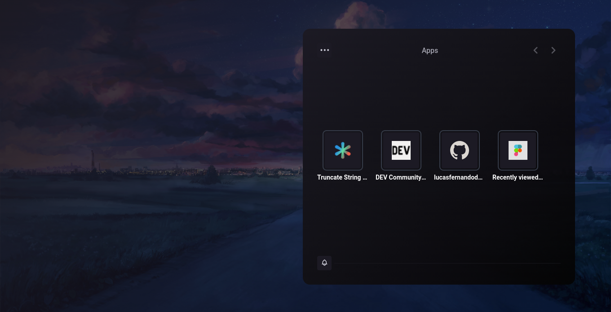

# Entardecer

Entardecer é uma extensão para o chrome com o objetivo de substituir a homepage.

### Começando

Para testar na sua maquina: 

```
git clone git@github.com:lucasfernandodev/entardecer.git
cd entarder
npm install
```

Com o projeto baixado e os pacotes instaladores, rode o projeto com o comando:

```
npm run dev

```

Agora que o projeto ta rodando, falta adicionar ele no chrome,
no chrome vá em Mais <b>ferramentas > Extensões</b>. Dentro de extensões procure pela opção "Carregar sem compactação" ao clicar vá até a pasta do seu projeto e adicione.

Com isso seu projeto já deve estar rodando!