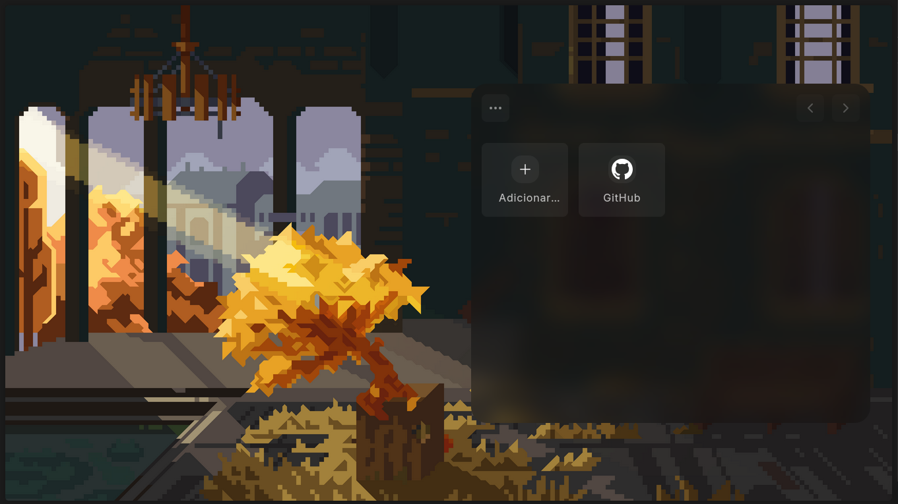

# Entardecer

Entardecer é uma extensão para Chrome que substitui a homepage padrão por uma experiência personalizada.

## Instalação

Você pode baixar a versão atual para **Firefox** neste link:
[Download Entardecer para Firefox](https://github.com/lucasfernandodev/entardecer/releases/download/latest/entardecer.xpi)

> ⚠️ Por se tratar de uma extensão não assinada, será necessário instalá-la no modo de depuração:  
> Acesse `about:debugging#/runtime/this-firefox` e carregue o arquivo manualmente.

## Desenvolvimento

1. Siga os passos abaixo para rodar o projeto localmente:

```
git clone git@github.com:lucasfernandodev/entardecer.git
cd entardecer
```

2. Instale as dependências:

```
pnpm install
```

3. Inicie o ambiente de desenvolvimento:

```
pnpm run dev
```

> ⚠️ Se for usar no Firefox use o comando `pnpm run build:watch`


### Carregue a extensão no Chrome:
- Abra o Chrome e acesse `chrome://extensions/` (ou pelo menu: Mais ferramentas > Extensões)
- Ative o *Modo do desenvolvedor* (canto superior direito)
- Clique em *Carregar sem compactação* e selecione a pasta raiz do projeto

### Carregue a extensão no Firefox:
- Abra o Firefox e acesse `about:debugging#/runtime/this-firefox`.
- Clique em “*Carregar complemento temporário*”.
- Selecione o arquivo `manifest.json` dentro da pasta `dist/`.

Pronto! A extensão estará rodando no seu navegador para testes.
